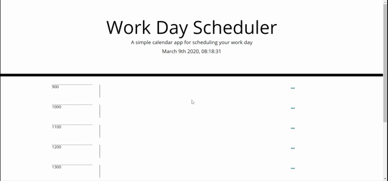

# Work Day Scheduler

Using a third-party API to create a work day planner displaying time block from 9am to 5pm. The planner is divided into 3 colomn. The first colomn display hour of the day. The second colomn has a text input field for user to add schedule. The third colomn has a save button, allow the user to save their schedule.

## Built With

- [HTML](https://developer.mozilla.org/en-US/docs/Web/HTML)
- [CSS](https://developer.mozilla.org/en-US/docs/Web/CSS)
- [Bootstrap](https://getbootstrap.com/)
- [Javascript](https://developer.mozilla.org/en-US/docs/Web/JavaScript)
- [Moment.js](https://momentjs.com/)

## Demo



## Code Snippets

Use Moment.js to set time and schedule block

```js
$("#currentDay").append(moment().format("MMMM Do YYYY, hh:mm:ss"));
```

## Deployed Link

- [See Live Site](https://kokevin678.github.io/work_day_scheduler/)

## Authors

**Kevin Ko**

- [Portfolio](https://kokevin678.github.io/responsive-portfolio/)
- [Github](https://github.com/kokevin678)
- [LinkedIn](https://www.linkedin.com/)
